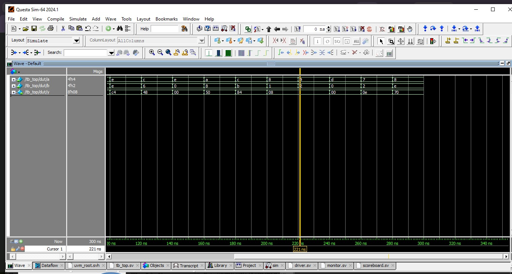

# 4-Bit Multiplier UVM Verification
## Project Overview
This project implements a 4-bit × 4-bit combinational multiplier in Verilog and verifies it using a complete UVM (Universal Verification Methodology) testbench in SystemVerilog.

The design takes two 4-bit inputs (a and b) and produces an 8-bit output (y), which is the product of the two inputs. Since the DUT is purely combinational, no clock is required for the DUT itself; however, the UVM testbench uses delay-based synchronization to drive inputs and sample outputs.

## ⚙️ How to Run the Simulation
This project is verified using Siemens QuestaSim. Follow these exact steps in the QuestaSim Transcript window:
#### 1. Create the work library
vlib work

#### 2. Compile the DUT, Interface, Package, and Top module
vlog -sv 4_bit_mul.v mul_if.sv mul_pkg.sv tb_top.sv

#### 3. Load the simulation with the test name
vsim +UVM_TESTNAME=test tb_top

#### 4. Add waveforms for debugging
add wave -position insertpoint sim:/tb_top/mif/*
add wave -position insertpoint sim:/tb_top/dut/*

#### 5. Run the simulation
run -all

## Waveform Image

<p align="center">
    
</p>

## 📊 Waveform & Verification Results

The final verified waveform confirms correct operation:

Inputs a and b change every 50ns.

The output y correctly reflects the 8-bit product of a and b.

The scoreboard reports 0 mismatches and the test ends with a UVM_FATAL or clean finish.

### Test Results

```
Time (ns)   a (hex)   b (hex)   Expected y (hex)   Actual y (hex)   Status
---------   -------   -------   ----------------   --------------   ------
20          2         6         0C                 0C               PASS
40          e         e         C4                 C4               PASS
60          c         2         18                 18               PASS
80          4         4         10                 10               PASS
100         d         8         68                 68               PASS
120         8         d         68                 68               PASS
```

### 🛠 Prerequisites\
Siemens QuestaSim (or compatible simulator like VCS, Xcelium)\
UVM 1.2 or higher
